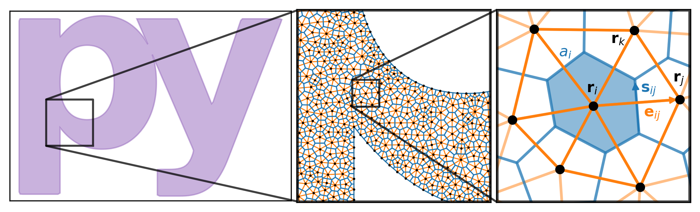

.. _background:

**********************
Theoretical Background
**********************

.. image:: images/logo-transparent-large.png
  :width: 300
  :alt: pyTDGL logo.
  :align: center

.. tip::

   ``pyTDGL`` is described in detail in the following paper:

     pyTDGL: Time-dependent Ginzburg-Landau in Python,
     Computer Physics Communications **291**, 108799 (2023),
     DOI: `10.1016/j.cpc.2023.108799 <https://doi.org/10.1016/j.cpc.2023.108799>`_.

   The accepted version of the paper can also be found on arXiv: `arXiv:2302.03812 <https://doi.org/10.48550/arXiv.2302.03812>`_.

Here we sketch out the generalized time-dependent Ginzburg-Landau model implemented in ``pyTDGL``, and the numerical methods used to solve it.
This material and portions of the ``pyTDGL`` package are based on Refs. :footcite:p:`Jonsson2022-xe, Jonsson2022-mb` (`repo <https://github.com/afsa/super-detector-py>`_). The generalized
time-dependent Ginzburg-Landau theory is based on Refs. :footcite:p:`Kramer1978-kb, Watts-Tobin1981-mn`. The numerical methods are based on
Refs. :footcite:p:`Jonsson2022-xe, Gropp1996-uw, Du1998-kt`.

``pyTDGL`` can model superconducting thin films of arbitrary geometry, including multiply-connected films (i.e., films with holes).
By "thin" or "two-dimensional" we mean that the film thickness :math:`d` is smaller than the coherence length :math:`\xi=\xi(T)`
and the London penetration depth :math:`\lambda=\lambda(T)`, where :math:`T` is temperature. This assumption implies that both the
superconducting order parameter :math:`\psi(\mathbf{r})` and the supercurrent :math:`\mathbf{J}_s(\mathbf{r})` are roughly
constant over the thickness of the film.
Strictly speaking, the model is only valid for temperatures very close to the critical
temperature, :math:`T/T_c\approx 1`, and for dirty superconductors where the inelastic diffusion length much smaller than the
coherence length :math:`\xi` :footcite:p:`Kramer1978-kb`.

Time-dependent Ginzburg-Landau
------------------------------

The time-dependent Ginzburg-Landau formalism employed here :footcite:p:`Kramer1978-kb` boils down to a set of coupled partial differential equations for a
complex-valued field :math:`\psi(\mathbf{r}, t)=|\psi|e^{i\theta}` (the superconducting order parameter)
and a real-valued field :math:`\mu(\mathbf{r}, t)` (the electric scalar potential), which evolve deterministically in time for a given
time-independent applied magnetic vector potential :math:`\mathbf{A}(\mathbf{r})`.

The order parameter :math:`\psi` evolves according to:

.. math::
    :label: tdgl

    \frac{u}{\sqrt{1+\gamma^2|\psi|^2}}\left(\frac{\partial}{\partial t}+i\mu+\frac{\gamma^2}{2}\frac{\partial |\psi|^2}{\partial t}\right)\psi
    =(\epsilon-|\psi|^2)\psi+(\nabla-i\mathbf{A})^2\psi

The quantity :math:`(\nabla-i\mathbf{A})^2\psi` is the covariant Laplacian of :math:`\psi`,
which is used in place of an ordinary Laplacian in order to maintain gauge-invariance of the order parameter. Similarly,
:math:`(\frac{\partial}{\partial t}+i\mu)\psi` is the covariant time derivative of :math:`\psi`.
:math:`u=\pi^4/(14\zeta(3))\approx5.79` is the ratio of relaxation times for the amplitude and phase of the order parameter in dirty superconductors
(:math:`\zeta` is the Riemann zeta function) and
:math:`\gamma` is a material parameter which is proportional to the inelastic scattering time and the size of the superconducting gap.
:math:`\epsilon(\mathbf{r})=T_c(\mathbf{r})/T - 1 \in [-1,1]` is a real-valued parameter that adjusts the local critical temperature of the film.
Setting :math:`\epsilon(\mathbf{r}) < 1` suppresses the critical temperature at position :math:`\mathbf{r}`, and extended
regions of :math:`\epsilon(\mathbf{r}) < 0` can be used to model large-scale metallic pinning sites
:footcite:p:`Sadovskyy2015-ha,Al_Luhaibi2022-cl,Kwok2016-of`.

The electric scalar potential :math:`\mu(\mathbf{r}, t)` evolves according to the Poisson equation:

.. math::
    :label: poisson

    \begin{split}
    \nabla^2\mu &= \nabla\cdot\mathrm{Im}[\psi^*(\nabla-i\mathbf{A})\psi] - \nabla\cdot\frac{\partial\mathbf{A}}{\partial t}\\
    &=\nabla\cdot\mathbf{J}_s - \nabla\cdot\frac{\partial\mathbf{A}}{\partial t},
    \end{split}

where :math:`\mathbf{J}_s=\mathrm{Im}[\psi^*(\nabla-i\mathbf{A})\psi]` is the supercurrent density. Again, :math:`(\nabla-i\mathbf{A})\psi`
is the covariant gradient of :math:`\psi`.

In addition to the electric potential (:eq:`poisson`), one can couple the dynamics of the order parameter
(:eq:`tdgl`) to other physical quantities to create a "multiphysics" model. For example, it is common to couple
the TDGL equations to the local temperature :math:`T(\mathbf{r}, t)` of the superconductor via a heat balance equation
to model self-heating :footcite:p:`Gurevich1987-sv, Berdiyorov2012-rn, Zotova2012-nc, Jelic2016-ww, Jing2018-qc`.

Boundary conditions
===================

Isolating boundary conditions are enforced on superconductor-vacuum interfaces,
in form of Neumann boundary conditions for :math:`\psi` and :math:`\mu`:

.. math::
    :label: bc-vacuum

    \begin{split}
        \hat{\mathbf{n}}\cdot(\nabla-i\mathbf{A})\psi &= 0 \\
        \hat{\mathbf{n}}\cdot\nabla\mu &= 0
    \end{split}

Superconductor-normal metal interfaces can be used to apply a bias current density :math:`J_\mathrm{ext}`.
For such interfaces, we impose Dirichlet boundary conditions on :math:`\psi` and Neumann boundary conditions on :math:`\mu`:

.. math::
    :label: bc-normal

    \begin{split}
        \psi &= 0 \\
        \hat{\mathbf{n}}\cdot\nabla\mu &= J_\mathrm{ext}
    \end{split}

A single model can have an arbitrary number of current terminals (although just 1 terminal is not allowed due to current conservation).
If we label the terminals :math:`i=1,2,\ldots`, we can express the global current conservation constraint as

.. math::
    :label: current-cons

    \sum_i I_{\mathrm{ext},i} = \sum_i J_{\mathrm{ext},i}L_i = 0,

where :math:`I_{\mathrm{ext},i}` is the total current through terminal :math:`i`, :math:`L_i` is the length of terminal :math:`i`,
and :math:`J_{\mathrm{ext},i}` is the current density along terminal :math:`i`, which we assume to be constant and directed normal to the terminal.
From :eq:`current-cons`, it follows that the current boundary condition for terminal :math:`i` is:

.. math::
    :label: bc-current

    J_{\mathrm{ext},i}=-\frac{1}{L_i}\sum_{j\neq i}I_{\mathrm{ext},j}=-\frac{1}{L_i}\sum_{j\neq i}J_{\mathrm{ext},j}L_j.

Units
=====

The TDGL model [:eq:`tdgl`, :eq:`poisson`] is solved in dimensionless units, where the scale factors are given in terms of fundamental constants and material parameters,
namely the superconducting coherence length :math:`\xi`, London penetration depth :math:`\lambda`, normal state conductivity :math:`\sigma`, and film thickness :math:`d`.
The Ginzburg-Landau parameter is defined as :math:`\kappa=\lambda/\xi`. :math:`\mu_0` is the vacuum permeability and :math:`\Phi_0=h/2e` is the
superconducting flux quantum.

- Time is measured in units of :math:`\tau_0 = \mu_0\sigma\lambda^2`
- Magnetic field is measured in units of the upper critical field :math:`B_0=B_{c2}=\mu_0H_{c2} = \frac{\Phi_0}{2\pi\xi^2}`
- Magnetic vector potential is measured in units of :math:`A_0=\xi B_0=\frac{\Phi_0}{2\pi\xi}`
- Current density is measured in units of :math:`J_0=\frac{4\xi B_{c2}}{\mu_0\lambda^2}`
- Sheet current density is measured in units of :math:`K_0=J_0 d=\frac{4\xi B_{c2}}{\mu_0\Lambda}`,
  where :math:`\Lambda=\lambda^2/d` is the effective magnetic penetration depth
- Voltage is measured in units of :math:`V_0=\xi J_0/\sigma=\frac{4\xi^2 B_{c2}}{\mu_0\sigma\lambda^2}`

Numerical implementation
------------------------

Finite volume method
====================

We solve the TDGL model [:eq:`tdgl`, :eq:`poisson`] on an unstructured `Delaunay mesh <https://en.wikipedia.org/wiki/Delaunay_triangulation>`_
in two dimensions :footcite:p:`Du1998-kt, Jonsson2022-xe`.
The mesh is composed of a set of sites, each denoted by its position :math:`\mathbf{r}_i\in\mathbb{R}^2` or an integer index :math:`i`,
and a set of triangular cells :math:`c_{ijk}`. Each cell :math:`c_{ijk}=(i, j, k)` represents a triangle with three edges
(:math:`(i, j)`, :math:`(j, k)`, and :math:`(k, i)`) that connect sites :math:`\mathbf{r}_i`, :math:`\mathbf{r}_j`, :math:`\mathbf{r}_k` in
a counterclockwise fashion. Each edge (denoted by the vector :math:`\mathbf{e}_{ij}=\mathbf{r}_j-\mathbf{r}_i` or the 2-tuple :math:`(i, j)`)
has a length :math:`e_{ij}=|\mathbf{e}_{ij}|` and a direction :math:`\hat{\mathbf{e}}_{ij}=\mathbf{e}_{ij}/e_{ij}`.
Each site is assigned an effective area :math:`a_i`, which is the area of the `Voronoi region <https://en.wikipedia.org/wiki/Voronoi_diagram>`_
surrounding the site.
The Voronoi region surrounding site :math:`i` consists of all points in space that are closer to site :math:`\mathbf{r}_i`
than to any other site in the mesh. The side of the Voronoi region that intersects edge :math:`(i, j)` is denoted
:math:`\mathbf{s}_{ij}` and has a length :math:`s_{ij}`. The collection of all Voronoi cells tesselates the film and forms a mesh that is
`dual <https://en.wikipedia.org/wiki/Dual_graph>`_ to the triangular Delaunay mesh.

A scalar function :math:`f(\mathbf{r}, t)` can be discretized at a given time :math:`t^{n}`
as the value of the function on each site, :math:`f_i^{n}=f(\mathbf{r}_i, t^{n})`.
A vector function :math:`\mathbf{F}(\mathbf{r}, t)` can be discretized at time :math:`t^{n}` as the flow of the vector field between sites.
In other words, :math:`F_{ij}^{n}=\mathbf{F}((\mathbf{r}_i+\mathbf{r}_j)/2, t^{n})\cdot\hat{\mathbf{e}}_{ij}`, where :math:`(\mathbf{r}_i+\mathbf{r}_j)/2=\mathbf{r}_{ij}`
is the center of edge :math:`(i, j)`.

The gradient of a scalar function :math:`g(\mathbf{r})` is approximated on the edges of the mesh. The value of :math:`\nabla g`
at position :math:`\mathbf{r}_{ij}` (i.e., the center of edge :math:`(i, j)`) is:

.. math::
    :label: gradient

    (\nabla g)_{ij}=\left.(\nabla g)\right|_{\mathbf{r}_{ij}}\approx\frac{g_j-g_i}{e_{ij}}\hat{\mathbf{e}}_{ij}

To calculate the divergence of a vector field :math:`\mathbf{F}(\mathbf{r})` on the mesh, we assume that
each Voronoi cell is small enough that the value of :math:`\nabla\cdot\mathbf{F}` is constant over the area of the cell and
equal to the value at the mesh site lying inside the cell, :math:`\mathbf{r}_i`. Then, using the
`divergence theorem <https://en.wikipedia.org/wiki/Divergence_theorem>`_ in two dimensions, we have

.. math::
    :label: divergence

    \begin{split}
        \int(\nabla\cdot\mathbf{F})\,\mathrm{d}^2\mathbf{r} &= \oint(\mathbf{F}\cdot\hat{\mathbf{n}})\,\mathrm{d}s\\
        \left.(\nabla\cdot\mathbf{F})a_i\right|_{\mathbf{r}_i}&\approx\sum_{j\in\mathcal{N}(i)}F_{ij}s_{ij}\\
        (\nabla\cdot\mathbf{F})_i=\left.(\nabla\cdot\mathbf{F})\right|_{\mathbf{r}_i}&\approx\frac{1}{a_i}\sum_{j\in\mathcal{N}(i)}F_{ij}s_{ij},
    \end{split}

where :math:`\mathcal{N}(i)` is the set of sites adjacent to site :math:`\mathbf{r}_i`.

The Laplacian of a scalar function :math:`g` is given by :math:`\nabla^2 g=\nabla\cdot\nabla g`, so combining :eq:`gradient` and :eq:`divergence` we have

.. math::
    :label: laplacian

    (\nabla^2g)_i=\left.(\nabla^2 g)\right|_{\mathbf{r}_i}\approx\frac{1}{a_i}\sum_{j\in\mathcal{N}(i)}\frac{g_j-g_i}{e_{ij}}s_{ij}

The discrete gradient, divergence, and Laplacian of a field at site :math:`i` depend only on the value of the field at
site :math:`i` and its nearest neighbors. This means that the corresponding operators, :eq:`gradient`, :eq:`divergence`, and :eq:`laplacian`,
can be represented efficiently as sparse matrices, and their action given  by a matrix-vector product.

Covariant derivatives
=====================

We use link variables :footcite:p:`Gropp1996-uw, Du1998-kt` to construct covariant versions of the spatial derivatives and time derivatives of :math:`\psi`.
In the discrete case corresponding to our finite volume method, this amounts to adding a complex phase whenever taking a difference
in :math:`\psi` between mesh sites (for spatial derivatives) or time steps (for time derivatives).

The discretized form of the covariant gradient of :math:`\psi` at time :math:`t^{n}` and edge :math:`\mathbf{r}_{ij}` is:

.. math::
    :label: grad-psi

    \left.\left(\nabla-i\mathbf{A}\right)\psi\right|_{\mathbf{r}_{ij}}^{t^{n}}=\frac{U^{n}_{ij}\psi_j^{n}-\psi_i^{n}}{e_{ij}},

where :math:`U^{n}_{ij}=\exp(-i\mathbf{A}(\mathbf{r}_{ij}, t^{n})\cdot\mathbf{e}_{ij}) = \exp(-iA_{ij}e_{ij})^{n}` is the spatial link variable.
:eq:`grad-psi` is similar to the `gauge-invariant phase difference <https://link.springer.com/article/10.1007/s10948-020-05784-9>`_
in Josephson junction physics.

The discretized form of the covariant Laplacian of :math:`\psi` at time :math:`t^{n}` and site :math:`\mathbf{r}_i` is:

.. math::
    :label: laplacian-psi

    \left.\left(\nabla-i\mathbf{A}\right)^2\psi\right|_{\mathbf{r}_{i}}^{t^{n}}=\frac{1}{a_i}\sum_{j\in\mathcal{N}(i)}\frac{U^{n}_{ij}\psi_j^{n}-\psi_i^{n}}{e_{ij}}s_{ij}

The discretized form of the covariant time-derivative of :math:`\psi` at time :math:`t^{n}` and site :math:`\mathbf{r}_i` is

.. math::
    :label: dmu_dt

    \left.\left(\frac{\partial}{\partial t}+i\mu\right)\psi\right|_{\mathbf{r}_i}^{t^{n}}=\frac{U_i^{n, n+1}\psi_i^{n+1}-\psi_i^{n}}{\Delta t^{n}},

where :math:`U_i^{n, n+1}=\exp(i\mu_i^{n}\Delta t^{n})` is the temporal link variable.

Implicit Euler method
=====================

The discretized form of the equations of motion for :math:`\psi(\mathbf{r}, t)` and :math:`\mu(\mathbf{r}, t)` are given by

.. math::
    :label: tdgl-num

    \begin{split}
        \frac{u}{\Delta t^{n}\sqrt{1 + \gamma^2\left|\psi_i^{n}\right|^2}}&
        \left[
            \psi_i^{n+1}\exp(i\mu_i^{n}\Delta t^{n})-\psi_i^{n}
            +\frac{\gamma^2}{2}\left(\left|\psi_i^{n+1}\right|^2-\left|\psi_i^{n}\right|^2\right)\psi_i^{n}
        \right]\\
        &=\left(\epsilon_i-\left|\psi_i^{n}\right|^2\right)\psi_i^{n}+\frac{1}{a_i}\sum_{j\in\mathcal{N}(i)}\frac{U^{n}_{ij}\psi_j^{n}-\psi_i^{n}}{e_{ij}}s_{ij}
    \end{split}

.. math::
    :label: poisson-num

    \begin{split}
    \sum_{j\in\mathcal{N}(i)}\frac{\mu_j^{n}-\mu_i^{n}}{e_{ij}}s_{ij}&
        =\sum_{j\in\mathcal{N}(i)}J_{ij}^{n}|s_{ij}| - \sum_{j\in\mathcal{N}(i)}\frac{A_{ij}^{n} - A_{ij}^{n-1}}{\Delta t^{n}}|s_{ij}|\\
    &=\sum_{j\in\mathcal{N}(i)}\mathrm{Im}\left\{\left(\psi_i^{n}\right)^*\,\frac{U^{n}_{ij}\psi_j^{n}-\psi_i^{n}}{e_{ij}}\right\}|s_{ij}|
    - \sum_{j\in\mathcal{N}(i)}\frac{A_{ij}^{n} - A_{ij}^{n-1}}{\Delta t^{n}}|s_{ij}|,
    \end{split}

where :math:`A_{ij}^{n} = \mathbf{A}(\mathbf{r}_{ij}, t^{n})\cdot\hat{\mathbf{e}}_{ij}` and :math:`\frac{A_{ij}^{n} - A_{ij}^{n-1}}{\Delta t^{n}}`
approximates the time derivative of the vector potential, :math:`\left.\partial\mathbf{A}/\partial t\right|_{\mathbf{r}_{ij}}^{t_n}`.

If we isloate the terms in :eq:`tdgl-num` involving the order parameter at time :math:`t^{n+1}`, we can rewrite :eq:`tdgl-num` in the form

.. math::
    :label: quad-1

    \psi_i^{n+1}+z_i^{n}\left|\psi_i^{n+1}\right|^2=w_i^{n},

where 

.. math::
    :label: z

    z_i^{n}=\frac{\gamma^2}{2}\exp(-i\mu_i^{n}\Delta t^{n})\psi_i^{n}

and

.. math::
    :label: w

    \begin{split}
    w_i^{n}=&z_{i}^{n}\left|\psi_i^{n}\right|^2+\exp(-i\mu_i^{n}\Delta t^{n})\times\\
    &\Biggl[\psi_i^{n}+\frac{\Delta t^{n}}{u}\sqrt{1+\gamma^2\left|\psi_i^{n}\right|^2}\times\\
    &\quad\biggl(
        \left(\epsilon_i-\left|\psi_i^{n}\right|^2\right)\psi_{i}^{n} +
        \frac{1}{a_i}\sum_{j\in\mathcal{N}(i)}\frac{U^{n}_{ij}\psi_j^{n}-\psi_i^{n}}{e_{ij}}s_{ij}
    \biggr)
    \Biggr]
    \end{split}

Solving :eq:`quad-1` for :math:`\left|\psi_i^{n+1}\right|^2`,
we arrive at a quadratic equation in :math:`\left|\psi_i^{n+1}\right|^2`
(see :ref:`appendix-euler` for the full calculation):

.. math::
    :label: quad-2

    \left|z_i^{n}\right|^2\left|\psi_i^{n+1}\right|^4
    -\left(2c_i^{n} + 1\right)\left|\psi_i^{n+1}\right|^2
    + \left|w_i^{n}\right|^2
    =0,

where we have defined 

.. math::

    c_i^{n}=
    \mathrm{Re}\left\{z_i^{n}\right\}\mathrm{Re}\left\{w_i^{n}\right\}
    +\mathrm{Im}\left\{z_i^{n}\right\}\mathrm{Im}\left\{w_i^{n}\right\}.

To solve :eq:`quad-2`, which has the form :math:`0=ax^2+bx+c`, we use a modified quadratic formula:

.. math::
    :label: citardauq

    \begin{split}
        x &= \frac{-b\pm\sqrt{b^2-4ac}}{2a}\cdot\frac{-b\mp\sqrt{b^2-4ac}}{-b\mp\sqrt{b^2-4ac}}\\
        % &=\frac{b^2-(b^2-4ac)}{2a(-b\mp\sqrt{b^2-4ac})}\\
        % &=\frac{4ac}{2a(-b\mp\sqrt{b^2-4ac})}\\
        &=\frac{2c}{-b\mp\sqrt{b^2-4ac}},
    \end{split}

in order to avoid numerical issues when :math:`a=\left|z_i^n\right|^2=0`, i.e., when :math:`\left|\psi_i^n\right|^2=0` or :math:`\gamma=0`.
Applying :eq:`citardauq` to :eq:`quad-2` yields

.. math::
    :label: quad-root

    \left|\psi_i^{n+1}\right|^2=\frac{2\left|w_i^{n}\right|^2}{(2c_i^{n} + 1)+\sqrt{(2c_i^{n} + 1)^2 - 4\left|z_i^{n}\right|^2\left|w_i^{n}\right|^2}},

We take the root with the ":math:`+`" sign in :eq:`quad-root` because the ":math:`-`" sign results in unphysical behavior where
:math:`\left|\psi_i^{n+1}\right|^2` diverges when :math:`\left|z_i^{n}\right|^2` vanishes (i.e., when :math:`\left|\psi_i^{n}\right|^2` is zero).

Combining :eq:`quad-1` and :eq:`quad-root` allows us to find the order parameter at time :math:`t^{n+1}` in terms of the 
order parameter and scalar potential at time :math:`t^{n}`:

.. math::
    :label: psi-sol

    \begin{split}
    \psi_i^{n+1} &= w_i^{n} - z_i^{n}\left|\psi_i^{n+1}\right|^2\\
    &=w_i^{n} - z_i^{n}\frac{2\left|w_i^{n}\right|^2}{(2c_i^{n} + 1)+\sqrt{(2c_i^{n} + 1)^2 - 4\left|z_i^{n}\right|^2\left|w_i^{n}\right|^2}}
    \end{split}

Combining :eq:`psi-sol` and :eq:`poisson-num` yields a sparse linear system that can be solved to find
:math:`\mu_i^{n+1}` given :math:`\mu_i^{n}` and :math:`\psi_i^{(n + 1)}`. The Poisson equation, :eq:`poisson-num`, is solved using
`sparse LU factorization <https://docs.scipy.org/doc/scipy/reference/generated/scipy.sparse.linalg.splu.html>`_ :footcite:p:`Li2005-gv`.

Adaptive time step
==================

``pyTDGL`` implements an adaptive time step algorithm that adjusts the time step :math:`\Delta t^{n}`
based on the speed of the system's dynamics. This functionality is useful if, for example, you are only interested
in the equilibrium behavior of a system. The dynamics may initially be quite fast and then slow down as you approach steady state.
Using an adaptive time step dramatically reduces the wall-clock time needed to model equilibrium behavior in such instances, without
sacrificing solution accuracy.

There are four parameters that control the adaptive time step algorithm, which are defined in :class:`tdgl.SolverOptions`:
:math:`\Delta t_\mathrm{init}` (``SolverOptions.dt_init``),
:math:`\Delta t_\mathrm{max}` (``SolverOptions.dt_max``),
and :math:`N_\mathrm{window}` (``SolverOptions.adaptive_window``) :math:`M_\mathrm{adaptive}` (``SolverOptions.adaptive_time_step_multiplier``).
The initial time step at iteration :math:`n=0` is set to :math:`\Delta t^{(0)}=\Delta t_\mathrm{init}`. We keep a running list of
:math:`\Delta|\psi|^2_n=\max_i \left|\left(\left|\psi_i^{n}\right|^2-\left|\psi_i^{n-1}\right|^2\right)\right|` for each iteration :math:`n`.
Then, for each iteration :math:`n > N_\mathrm{window}`, we define a tentative new time step :math:`\Delta t_\star`
using the following heuristic:

.. math::
    :label: dt-tentative

    \delta_n &= \frac{1}{N_\mathrm{window}}\sum_{\ell=0}^{N_\mathrm{window}-1}\Delta|\psi|^2_{n-\ell}\\
    \Delta t_\star & = \min\left(\frac{1}{2}\left(\Delta t^n +  \frac{\Delta t_\mathrm{init}}{\delta_n}\right),\;\Delta t_\mathrm{max}\right)

:eq:`dt-tentative` has the effect of automatically selecting a small time step if the recent dynamics
of the order parameter are fast, and a larger time step if the dynamics are slow.

.. note::
    Because new time steps are chosen based on the dynamics of the order parameter, we recommend disabling
    the adaptive time step algorithm or using a strict :math:`\Delta t_\mathrm{max}` in cases where the entire
    superconductor is in the normal state, :math:`\psi=0`. You can use a fixed time step by setting
    ``tdgl.SolverOptions(..., adaptive=False, ...)``.

The the time step selected at iteration :math:`n` as described above may be too large to accurately solve for the state
of the system in iteration :math:`m=n+1`. We detect such a failure to converge by evaluating the discriminant of
:eq:`quad-2`. If the discriminant, :math:`(2c_i^{m} + 1)^2 - 4|z_i^{m}|^2|w_i^{m}|^2`, is less than zero for any
site :math:`i`, then the value of :math:`|\psi_i^{m+1}|^2` found in :eq:`quad-root` will be complex, which is unphysical.
If this happens, we iteratively reduce the time step :math:`\Delta t^{m}`
(setting :math:`\Delta t^{m} \leftarrow \Delta t^{m}\times M_\mathrm{adaptive}` at each iteration) and re-solve :eq:`quad-2` until
the discriminant is nonnegative for all sites :math:`i`, then proceed with the rest of the calculation for iteration :math:`m`.

.. _appendix-euler:

Appendices
----------

Implicit Euler method
=====================

Here we go through the full derivation of the quadratic equation for :math:`\left|\psi_i^{n+1}\right|^2`,
:eq:`quad-2`, starting from :eq:`quad-1`:

.. math::
    :label: quad-full

    \begin{split}
        \psi_i^{n+1} =& w_i^{n} - z_i^{n}\left|\psi_i^{n+1}\right|^2\\
        \left|\psi_i^{n+1}\right|^2 =& \left(\psi_i^{n+1}\right)^*\left(\psi_i^{n+1}\right)\\
        =& \left(w_i^{n}-z_i^{n}\left|\psi_i^{n+1}\right|^2\right)^*\left(w_i^{n}-z_i^{n}\left|\psi_i^{n+1}\right|^2\right)\\
        =& \left|w_i^{n}\right|^2 \\
        & - {w_i^{n}}^*z_i^{n}\left|\psi_i^{n+1}\right|^2\\
        & - w_i^{n}{z_i^{n}}^*\left|\psi_i^{n+1}\right|^2 \\
        & + \left|z_i^{n}\right|^2\left|\psi_i^{n+1}\right|^4\\
        \left|\psi_i^{n+1}\right|^2\left(1 + {w_i^{n}}^*z_i^{n} + w_i^{n}{z_i^{n}}^*\right)
        =&\left|w_i^{n}\right|^2 + \left|z_i^{n}\right|^2\left|\psi_i^{n+1}\right|^4\\
        {w_i^{n}}^*z_i^{n} + w_i^{n}{z_i^{n}}^* =& 2\left(\mathrm{Re}\{w_i^{n}\}\mathrm{Re}\{z_i^{n}\}+\mathrm{Im}\{w_i^{n}\}\mathrm{Im}\{z_i^{n}\}\right)\\
        =& 2c_i^{n}\\
        0 =& \left|z_i^{n}\right|^2\left|\psi_i^{n+1}\right|^4 - (2c_i^{n} + 1)\left|\psi_i^{n+1}\right|^2 + \left|w_i^{n}\right|^2
        
    \end{split}

Screening
=========

By default ``pyTDGL`` assumes that screening is negligible, i.e., that the total vector potential in the film is time-independent
and equal to the applied vector potential: :math:`\mathbf{A}(\mathbf{r}, t)=\mathbf{A}_\mathrm{applied}(\mathbf{r})`.
Screening can optionally be included by evaluating the vector potential induced by currents flowing in the film.
The vector potential in a 2D film induced by a sheet current density :math:`\mathbf{K}` flowing in the film is given by

.. math::
    :label: A-induced

    \mathbf{A}_\mathrm{induced}(\mathbf{r}, t) =
    \frac{\mu_0}{4\pi}\int_\mathrm{film}\frac{\mathbf{K}(\mathbf{r}', t)}{|\mathbf{r}-\mathbf{r}'|}\,\mathrm{d}^2\mathbf{r}'.

Taking the induced vector potential into account, the total vector potential in the film is

.. math::
    :label: A-total

    \mathbf{A}(\mathbf{r}, t)=\mathbf{A}_\mathrm{applied}(\mathbf{r})+\mathbf{A}_\mathrm{induced}(\mathbf{r}, t).

Because :math:`\mathbf{A} =\mathbf{A}_\mathrm{applied}+\mathbf{A}_\mathrm{induced}` enters into the covariant gradient and Laplacian of
:math:`\psi` (:eq:`grad-psi` and :eq:`laplacian-psi`), which in turn determine the current density :math:`\mathbf{J}=\mathbf{K}/d`,
which determines :math:`\mathbf{A}_\mathrm{induced}`, :eq:`A-induced` must be solved self-consistently at each time step :math:`t^n`.
The strategy for updating the induced vector potential to converge to a self-consistent value is based on Polyak's
"heavy ball" method :footcite:p:`Polyak1964-gb,Holmvall2022-ps`:

.. math::
    :label: polyak

    \mathbf{A}^{n,s}_{\mathrm{induced},ij} &= \frac{\mu_0}{4\pi}\sum_{\text{sites } \ell}\frac{\mathbf{K}^{n,s}_\ell}{|\mathbf{r}_{ij}-\mathbf{r}_\ell|}a_\ell\label{eq:polyak-A}\\
    \mathbf{d}^{n,s}_{ij} &= \mathbf{A}^{n,s}_{\mathrm{induced},ij} - \mathbf{A}^{n,s-1}_{\mathrm{induced},ij}\\
    \mathbf{v}^{n,s+1} &= (1-\beta)\mathbf{v}^{n,s} + \alpha\mathbf{d}^{n,s}_{ij}\label{eq:polyak-velocity}\\
    \mathbf{A}^{n,s+1}_{\mathrm{induced},ij} &= \mathbf{A}^{n,s}_{\mathrm{induced},ij} + \mathbf{v}^{n,s+1}_{ij}

The integer index :math:`s` counts the number of iterations performed in the self-consistent calculation.
The parameters :math:`\alpha\in(0,\infty)` and :math:`\beta\in(0,1)` in :eq:`polyak` can be set by the user,
and the initial conditions for :eq:`polyak` are :math:`\mathbf{A}^{n,0}_{\mathrm{induced},ij} = \mathbf{A}^{n-1}_{\mathrm{induced},ij}`
and :math:`\mathbf{v}^{n,0}_{ij} = \mathbf{0}`. The iterative application of :eq:`polyak` terminates when the relative change in the
induced vector potential between iterations falls below a user-defined tolerance.

In :eq:`polyak`, we evaluate the sheet current density :math:`\mathbf{K}^n_\ell=\mathbf{K}(\mathbf{r}_\ell,t^n)` on the mesh
sites :math:`\mathbf{r}_\ell`, and the vector potential on the mesh edges :math:`\mathbf{r}_{ij}`, so the denominator
:math:`|\mathbf{r}_{ij}-\mathbf{r}_\ell|` is strictly greater than zero and :eq:`polyak` is well-defined.
:eq:`polyak` involves the pairwise distances between all edges and all sites in the mesh, so,
in contrast to the sparse finite volume calculation, it requires a dense matrix representation. This means that
including screening significantly increases both the memory and number of floating point operations required for a
TDGL simulation. To accelerate this portion of the calculation, the first line of :eq:`polyak` is automatically evaluated on a graphics processing unit (GPU)
if one is available. Although including screening does introduce some time-dependence to the total vector potential in the film
(:eq:`A-total`), we assume that :math:`\partial\mathbf{A}/\partial t` remains small enough that the electric field in the film is
:math:`\mathbf{E}=-\nabla\mu - \partial\mathbf{A}/\partial t \approx -\nabla\mu`. The screening calculation (:eq:`polyak`) can fail
to converge for models with strong screening, where the effective magnetic penetration depth :math:`\Lambda=\lambda^2/d` is much smaller
than the film size.

Pseduocode for the solver algorithms
====================================

Adaptive Euler update
*********************

Adaptive Euler update subroutine. The parameters :math:`M_\mathrm{adaptive}` and :math:`N_\mathrm{retries}^\mathrm{max}` can be set by the user.

    | **Data**: :math:`\psi_i^n`, :math:`\Delta t_\star`, :math:`M_\mathrm{adaptive}`, :math:`N_\mathrm{retries}^\mathrm{max}`
    | **Result**: :math:`\psi_i^{n+1}`, :math:`\Delta t^n`
    - :math:`\Delta t^n \gets \Delta t_\star`
    - Calculate :math:`z_i^n`, :math:`w_i^n`, :math:`\left|\psi_i^{n+1}\right|^2` given :math:`\Delta t^n` (:eq:`z`, :eq:`w`, :eq:`quad-root`)
    - if *adaptive*:

        - :math:`N_\mathrm{retries} \gets 0`
        - while :math:`\left|\psi_i^{n+1}\right|^2` is complex for any site :math:`i`:

            - if :math:`N_\mathrm{retries} > N_\mathrm{retries}^\mathrm{max}`:

                - Failed to converge - raise an error.
            - :math:`\Delta t^n \gets \Delta t^n \times M_\mathrm{adaptive}`
            - Calculate :math:`z_i^n`, :math:`w_i^n`, :math:`\left|\psi_i^{n+1}\right|^2` given :math:`\Delta t^n` (:eq:`z`, :eq:`w`, :eq:`quad-root`)
            - :math:`N_\mathrm{retries} \gets N_\mathrm{retries} + 1`
    - :math:`\psi_i^{n+1} \gets w_i^n - z_i^n \left|\psi_i^{n+1}\right|^2` (:eq:`psi-sol`)

Solve step, no screening
************************

A single solve step, in which we solve for the state of the system at time :math:`t^{n+1}`
given the state of the system at time :math:`t^n`, with no screening.

    | **Data**: :math:`n`, :math:`t^n`, :math:`\Delta t_\star`, :math:`\psi_i^{n}`, :math:`\mu_i^{n}`
    | **Result**: :math:`t^{n+1}`, :math:`\Delta t^{n}`, :math:`\psi_i^{n+1}`, :math:`\mu_i^{n+1}`, :math:`J_{s,ij}^{n+1}`, :math:`J_{n,ij}^{n+1}`, :math:`\Delta t_\star`

    - Evaluate current density :math:`J^{n+1}_{\mathrm{ext},\,k}` for terminals :math:`k` (:eq:`bc-current`)
    - Update boundary conditions for :math:`\mu_i^{n+1}` (:eq:`bc-normal`)
    - Calculate :math:`\psi_i^{n+1}` and :math:`\Delta t^n` via `Adaptive Euler update <#adaptive-euler-update>`_
    - Calculate the supercurrent density :math:`J_{s,ij}^{n+1}` (:eq:`poisson-num`)
    - Solve for :math:`\mu_i^{n+1}` via sparse LU factorization (:eq:`poisson-num`)
    - Evaluate normal current density :math:`J_{n,ij}^{n+1}` via :math:`\mathbf{J}_n=-\nabla\mu - \frac{\partial\mathbf{A}}{\partial t}`
    - if *adaptive*:

        - Select new tentative time step :math:`\Delta t_\star` given :math:`\Delta t^n` (:eq:`dt-tentative`)
    - :math:`t^{n+1} \gets t^{n} + \Delta t^{n}`
    - :math:`n \gets n + 1`

Solve step, with screening
**************************

    A single solve step, with screening. The parameters :math:`A_\mathrm{tol}` and :math:`N_\mathrm{screening}^\mathrm{max}` can be set by the user.

    | **Data**: :math:`n`, :math:`t^n`, :math:`\Delta t_\star`, :math:`\psi_i^{n}`, :math:`\mu_i^{n}`, :math:`\mathbf{A}^n_{\mathrm{induced}}`
    | **Result**: :math:`t^{n+1}`, :math:`\Delta t^{n}`, :math:`\psi_i^{n+1}`, :math:`\mu_i^{n+1}`, :math:`J_{s,ij}^{n+1}`, :math:`J_{n,ij}^{n+1}`, :math:`\mathbf{A}^{n+1}_{\mathrm{induced}}`, :math:`\Delta t_\star`
    
    - Evaluate current density :math:`J^{n+1}_{\mathrm{ext},\,k}` for terminals :math:`k` (:eq:`bc-current`)
    - Update boundary conditions for :math:`\mu_i^{n+1}` (:eq:`bc-normal`)
    - :math:`s \gets 0`, screening iteration index
    - :math:`\mathbf{A}^{n+1,s}_\mathrm{induced} \gets \mathbf{A}^{n}_\mathrm{induced}`, initialize induced vector potential based on solution from previous time step
    - :math:`\delta A_\mathrm{induced} \gets \infty`, relative error in induced vector potential
    - while :math:`\delta A_\mathrm{induced} > A_\mathrm{tol}`:

        - if :math:`s > N_\mathrm{screening}^\mathrm{max}`:

            - Failed to converge - raise an error.
        - if :math:`s==0`:

            - :math:`\Delta t^n \gets \Delta t_\star`, initial guess for new time step
        - Update link variables in :math:`(\nabla-i\mathbf{A})` and :math:`(\nabla -i\mathbf{A})^2` given :math:`\mathbf{A}_\mathrm{induced}^{n+1,s}` (:eq:`grad-psi`, :eq:`laplacian-psi`)
        - Calculate :math:`\psi_i^{n+1}` and :math:`\Delta t^n` via `Adaptive Euler update <#adaptive-euler-update>`_
        - Calculate the supercurrent density :math:`J_{s,ij}^{n+1}` (:eq:`poisson-num`)
        - Solve for :math:`\mu_i^{n+1}` via sparse LU factorization (:eq:`poisson-num`)
        - Evaluate normal current density :math:`J_{n,ij}^{n+1}` via :math:`\mathbf{J}_n=-\nabla\mu  - \frac{\partial\mathbf{A}}{\partial t}`
        - Evaluate :math:`\mathbf{K}_i^{n+1}=d(\mathbf{J}_{s,i}^{n+1}+\mathbf{J}_{n,i}^{n+1})` at the mesh sites :math:`i`
        - Update induced vector potential :math:`\mathbf{A}^{n+1,s}_\mathrm{induced}` (:eq:`polyak`)
        - if :math:`s > 1`:

            - :math:`\delta A_\mathrm{induced} \gets \max_\mathrm{edges}\left(\left|\mathbf{A}^{n+1,s}_\mathrm{induced}-\mathbf{A}^{n+1,s-1}_\mathrm{induced}\right|/\left|\mathbf{A}^{n+1,s}_\mathrm{induced}\right|\right)`

        - :math:`s \gets s + 1`
    - :math:`\mathbf{A}^{n+1}_\mathrm{induced} \gets \mathbf{A}^{n+1,s}_\mathrm{induced}`, self-consistent value of the induced vector potential
    - if *adaptive*:
        
        - Select new tentative time step :math:`\Delta t_\star` (:eq:`dt-tentative`)
    - :math:`t^{n+1} \gets t^{n} + \Delta t^{n}`
    - :math:`n \gets n + 1`

References
----------

.. footbibliography::
