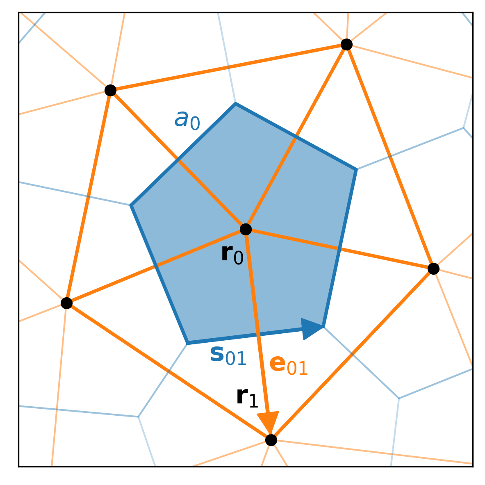

.. _background:

**********************
Theoretical Background
**********************

Here we sketch out the generalized time-dependent Ginzburg-Landau model implemented in ``pyTDGL``, and the numerical methods used to solve it.
This material is largely based on the following references: [Jonsson-PRA-2022]_, [Jonsson-PHD-2022]_.

``pyTDGL`` can model superconducting thin films of arbitrary geometry, including multiply-connected films (i.e., films with holes).
By "thin" or "two-dimensional" we mean that the film thickness :math:`d` is smaller than the coherence length :math:`\xi`
and the London penetration depth :math:`\lambda`. This assumption implies that both the superconducting order parameter :math:`\psi(\mathbf{r})`
and the supercurrent :math:`\mathbf{J}_s(\mathbf{r})` are roughly constant over the thickness of the film.

Time-dependent Ginzburg-Landau
------------------------------

The time-dependent Ginzburg-Landau formalism employed here boils down to a set of coupled partial differential equations for a
complex-valued field :math:`\psi(\mathbf{r}, t)=|\psi|e^{i\theta}` (the superconducting order parameter)
and a real-valued field :math:`\mu(\mathbf{r}, t)` (the electric scalar potential), which evolve deterministically in time for a given
time-independent applied magnetic vector potential :math:`\mathbf{A}(\mathbf{r})`.

The order parameter :math:`\psi` evolves according to:

.. math::
    :label: tdgl

    \frac{u}{\sqrt{1+\gamma^2|\psi|^2}}\left(\frac{\partial}{\partial t}+i\mu+\frac{\gamma^2}{2}\frac{\partial |\psi|^2}{\partial t}\right)\psi
    =(1-|\psi|^2)\psi+(\nabla-i\mathbf{A})^2\psi

The quantity :math:`(\nabla-i\mathbf{A})^2\psi` is the covariant Laplacian of :math:`\psi`,
which is used in place of an ordinary Laplacian in order to maintain gauge-invariance of the order parameter. Similarly,
the quantity :math:`(\frac{\partial}{\partial t}+i\mu)\psi` is the covariant time derivative of :math:`\psi`.
:math:`u=5.79` is the ratio of relaxation times for the amplitude and phase of the order parameter in dirty superconductors and
:math:`\gamma` is a material parameter that characterizes the influence of the inelastic phonon-electron scattering.

.. .. math::
..     :label: helmholtz

..     \kappa^2\nabla\times\nabla\times\mathbf{A} = \mathbf{J}_s-\nabla\mu-\frac{\partial\mathbf{A}}{\partial t}

The electric scalar potential :math:`\mu(\mathbf{r}, t)` evolves according to:

.. math::
    :label: poisson

    \begin{split}
    \nabla^2\mu &= \nabla\cdot\mathrm{Im}[\psi^*(\nabla-i\mathbf{A})\psi]\\
    &=\nabla\cdot\mathbf{J}_s,
    \end{split}

where :math:`\mathbf{J}_s=\mathrm{Im}[\psi^*(\nabla-i\mathbf{A})\psi]` is the supercurrent density. Again, :math:`(\nabla-i\mathbf{A})\psi`
is the covariant gradient of :math:`\psi`.

Boundary conditions
===================

Isolating boundary conditions are enforced on superconductor-vacuum interfaces,
in form of Neumann boundary conditions for :math:`\psi` and :math:`\mu`:

.. math::
    :label: bc-vacuum

    \begin{split}
        \mathbf{n}\cdot(\nabla-i\mathbf{A})\psi &= 0 \\
        \mathbf{n}\cdot\nabla\mu &= 0
    \end{split}

Superconductor-normal metal interfaces can be used to apply a bias current density :math:`J_\mathrm{ext}`.
For such interfaces, we impose Dirichlet boundary conditions on :math:`\psi` and Neumann boundary conditions on :math:`\mu`:

.. math::
    :label: bc-normal

    \begin{split}
        \psi &= 0 \\
        \mathbf{n}\cdot\nabla\mu &= J_\mathrm{ext}
    \end{split}

One may also model normal-metal inclusions by fixing :math:`\psi(\mathbf{r})=0` for some set of points :math:`\mathbf{r}` inside the film. This can be used to simulate pinning centers. 

Units
=====

The TDGL model [:eq:`tdgl`, :eq:`poisson`] is solved in dimensionless units, where the scale factors are given in terms of fundamental constants and material parameters,
namely the superconducting coherence length :math:`\xi`, London penetration depth :math:`\lambda`, normal state conductivity :math:`\sigma`, and film thickness :math:`d`.
The Ginzburg-Landau parameter is defined as :math:`\kappa=\lambda/\xi`. :math:`\mu_0` is the vacuum permeability and :math:`\Phi_0=h/2e` is the
superconducting flux quantum.

- Time is measured in units of :math:`\tau_0 = \mu_0\sigma\lambda^2`
- Magnetic field is measured in units of the upper critical field :math:`B_0=B_{c2}=\mu_0H_{c2} = \frac{\Phi_0}{2\pi\xi^2}`
- Magnetic vector potential is measured in units of :math:`A_0=\xi B_0=\frac{\Phi_0}{2\pi\xi}`
- Current density is measured in units of :math:`J_0=\frac{4\xi B_{c2}}{\mu_0\lambda^2}`
- Sheet current density is measured in units of :math:`K_0=J_0 d=\frac{4\xi B_{c2}}{\mu_0\Lambda}`,
  where :math:`\Lambda=\lambda^2/d` is the effective magnetic penetration depth
- Voltage is measured in units of :math:`V_0=\xi J_0/\sigma=\frac{4\xi^2 B_{c2}}{\mu_0\sigma\lambda^2}`

.. Time is measured in units of :math:`\tau_0`:

.. .. math::
..     :label: tau0

..     \tau_0 = \mu_0\sigma\lambda^2

.. Magnetic field is measured in units of the upper critical field :math:`B_0=B_{c2}`:

.. .. math::
..     :label: B0

..     B_0 = B_{c2} = \mu_0H_{c2} = \frac{\Phi_0}{2\pi\xi^2}

.. Magnetic vector potential is measured in units of :math:`A_0=\xi B_0`:

.. .. math::
..     :label: A0

..     A_0 = \xi B_0 = \frac{\Phi_0}{2\pi\xi}

.. Current density is measured in units of :math:`J_0`:

.. .. math::
..     :label: J0

..     J_0 = \frac{4\xi B_{c2}}{\mu_0\lambda^2}

.. Sheet current density is measured in units of :math:`K_0=J_0 d`:

.. .. math::
..     :label: K0

..     K_0 = J_0 d = \frac{4\xi B_{c2}}{\mu_0\Lambda},

.. where :math:`\Lambda=\lambda^2/d` is the effective magnetic penetration depth.

.. Voltage is measured in units of :math:`V_0=\xi J_0/\sigma`:

.. .. math::
..     :label: V0

..     V_0 = \frac{\xi J_0}{\sigma} = \frac{4\xi^2 B_{c2}}{\mu_0\sigma\lambda^2}

Finite volume method
--------------------

We solve the TDGL model [:eq:`tdgl`, :eq:`poisson`] on an unstructured Delaunay mesh in two dimenions.
The mesh is composed of a set of sites :math:`\mathbf{r}_i`
and a set of triangular cells :math:`c_{ijk}`. Each cell :math:`c_{ijk}=(i, j, k)` represents a triangle with three edges
(:math:`(i, j)`, :math:`(j, k)`, and :math:`(k, i)`) that connect sites :math:`\mathbf{r}_i`, :math:`\mathbf{r}_j`, :math:`\mathbf{r}_k` in
a counterclockwise fashion. Each edge has a length :math:`e_{ij}=|\mathbf{r}_j-\mathbf{r}_i|` and a direction :math:`\hat{e}_{ij}=(\mathbf{r}_j-\mathbf{r}_i)/e_{ij}`.
Each site is assigned an effective area :math:`a_i`, which is the area of the `Voronoi region <https://en.wikipedia.org/wiki/Voronoi_diagram>`_
surrounding the site.
The Voronoi region surrounding site :math:`\mathbf{r}_i` consists of all points in space that are closer to site :math:`\mathbf{r}_i`
than to any other site in the mesh. The side of the Voronoi region that intersects edge :math:`(i, j)` is denoted
:math:`\mathbf{s}_{ij}` and has a length :math:`s_{ij}`.

A scalar function :math:`f(\mathbf{r}, t)` can be discretized at a given time :math:`t^{(n)}`
as the value of the function on each site, :math:`f_i^{(n)}=f(\mathbf{r}_i, t^{(n)})`.
A vector function :math:`\mathbf{F}(\mathbf{r}, t)` can be discretized at time :math:`t^{(n)}` as the flow of the vector field between sites.
In other words, :math:`F_{ij}^{(n)}=\mathbf{F}((\mathbf{r}_i+\mathbf{r}_j)/2, t^{(n)})\cdot\hat{e}_{ij}`, where :math:`(\mathbf{r}_i+\mathbf{r}_j)/2=\mathbf{r}_{ij}`
is the center of edge :math:`(i, j)`.

To calculate the divergence of a vector field :math:`\mathbf{F}(\mathbf{r})` on the mesh, we assume that
each Voronoi cell is small enough that the value of :math:`\nabla\cdot\mathbf{F}` is constant over the area of the cell and
equal to the value at the cell center, :math:`\mathbf{r}_i`.
Then, using the `divergence theorem <https://en.wikipedia.org/wiki/Divergence_theorem>`_ in two dimensions, we have

.. math::
    :label: divergence

    \begin{split}
        \int(\nabla\cdot\mathbf{F})\,\mathrm{d}^2\mathbf{r} &= \oint(\mathbf{F}\cdot\hat{n})\,\mathrm{d}s\\
        \left.(\nabla\cdot\mathbf{F})a_i\right|_{\mathbf{r}_i}&\approx\sum_{j\in\mathcal{N}(i)}F_{ij}s_{ij}\\
        (\nabla\cdot\mathbf{F})_i=\left.(\nabla\cdot\mathbf{F})\right|_{\mathbf{r}_i}&\approx\frac{1}{a_i}\sum_{j\in\mathcal{N}(i)}F_{ij}s_{ij},
    \end{split}

where :math:`\mathcal{N}(i)` is the set of sites adjacent to site :math:`\mathbf{r}_i`.
The gradient of a scalar function :math:`g(\mathbf{r})` is approximated on the edges of the mesh. The value of :math:`\nabla g`
at position :math:`\mathbf{r}_{ij}` (i.e., the center of edge :math:`(i, j)`) is:

.. math::
    :label: gradient

    (\nabla g)_{ij}=\left.(\nabla g)\right|_{\mathbf{r}_{ij}}\approx\frac{g_j-g_i}{e_{ij}}\hat{e}_{ij}

The Laplacian of a scalar function :math:`g` is given by :math:`\nabla^2 g=\nabla\cdot\nabla g`, so combining :eq:`divergence` and :eq:`gradient` we have

.. math::
    :label: laplacian

    (\nabla^2g)_i=\left.(\nabla^2 g)\right|_{\mathbf{r}_i}\approx\frac{1}{a_i}\sum_{j\in\mathcal{N}(i)}\frac{g_j-g_i}{e_{ij}}s_{ij}

Covariant derivatives
=====================

.. math::
    :label: link-sym

    U_{ij}(t) = U(\mathbf{r}_i,\mathbf{r}_j, t) = \exp\left(-i\int_i^{\mathbf{r}_j}\mathbf{A}(\mathbf{r}, t)\cdot\mathrm{d}\mathbf{r}\right)

The discretized form of the covariant time-derivative of :math:`\psi` at time :math:`t^{(n)}` and site :math:`\mathbf{r}_i` is

.. math::
    :label: dmu_dt

    \left.\left(\frac{\partial}{\partial t}+i\mu\right)\psi\right|_{\mathbf{r}_i}^{t^{(n)}}=\frac{\psi_i^{(n+1)}\exp(i\mu_i^{(n)}\Delta t^{(n)})-\psi_i^{(n)}}{\Delta t^{(n)}}

The discretized form of the covariant gradient of :math:`\psi` at time :math:`t^{(n)}` and edge :math:`\mathbf{r}_{ij}` is:

.. math::
    :label: grad-psi

    \left.\left(\nabla-i\mathbf{A}\right)\psi\right|_{\mathbf{r}_{ij}}^{t^{(n)}}=\frac{\psi_i^{(n)}\exp(-iA_{ij}e_{ij})-\psi_i^{(n)}}{e_{ij}}

The discretized form of the covariant Laplacian of :math:`\psi` at time :math:`t^{(n)}` and site :math:`\mathbf{r}_i` is:

.. math::
    :label: lapacian-psi

    \left.\left(\nabla-i\mathbf{A}\right)^2\psi\right|_{\mathbf{r}_{i}}^{t^{(n)}}=\frac{1}{a_i}\sum_{j\in\mathcal{N}(i)}\frac{\psi_i^{(n)}\exp(-iA_{ij}e_{ij})-\psi_i^{(n)}}{e_{ij}}s_{ij}

Implicit Euler method
=====================

The discretized form of the equations of motion for :math:`\psi(\mathbf{r}, t)` and :math:`\mu(\mathbf{r}, t)` are given by

.. .. math::
..     :label: tdgl-num1

..     \begin{split}
..         \frac{u}{\sqrt{1+\gamma^2\left|\psi_i^{(n)}\right|^2}}&
..         \left[
..             \left.\left(\frac{\partial}{\partial t}+i\mu\right)\psi\right|_{\mathbf{r}_i}^{t^{(n)}}
..             +\frac{\gamma^2}{2}\frac{\partial|\psi_{i}^{(n)}|^2}{\partial t}
..         \right]\\
..         &=\left(1-\left|\psi_i^{(n)}\right|^2\right)\psi_i^{(n)} + \left.\left(\nabla-i\mathbf{A}\right)^2\psi\right|_{\mathbf{r}_i}^{t^{(n)}}
..     \end{split}

.. math::
    :label: tdgl-num2

    \begin{split}
        \frac{u}{\Delta t^{(n)}\sqrt{1 + \gamma^2\left|\psi_i^{(n)}\right|^2}}&
        \left[
            \psi_i^{(n+1)}\exp(i\mu_i^{(n)}\Delta t^{(n)})-\psi_i^{(n)}
            +\frac{\gamma^2}{2}\left(\left|\psi_i^{(n+1)}\right|^2-\left|\psi_i^{(n)}\right|^2\right)\psi_i^{(n)}
        \right]\\
        &=\left(1-\left|\psi_i^{(n)}\right|^2\right)\psi_i^{(n)}+\frac{1}{a_i}\sum_{j\in\mathcal{N}(i)}\frac{\psi_i^{(n)}\exp(-iA_{ij}e_{ij})-\psi_i^{(n)}}{e_{ij}}s_{ij}
    \end{split}

.. math::
    :label: poisson-num

    \begin{split}
    \sum_{j\in\mathcal{N}(i)}\frac{\mu_j^{(n)}-\mu_i^{(n)}}{e_{ij}}s_{ij}&=\sum_{j\in\mathcal{N}(i)}J_{ij}^{(n)}|s_{ij}|\\
    &=\sum_{j\in\mathcal{N}(i)}\mathrm{Im}\left\{\left(\psi_i^{(n)}\right)^*\,\frac{\psi_i^{(n)}\exp(-iA_{ij}e_{ij})-\psi_i^{(n)}}{e_{ij}}\right\}|s_{ij}|
    \end{split}

If we isloate the terms in :eq:`tdgl-num2` involving the order parameter at time :math:`t^{(n+1)}`, we can rewrite :eq:`tdgl-num2` in the form

.. math::
    :label: quad-1

    \psi_i^{(n+1)}+z_i^{(n)}\left|\psi_i^{(n+1)}\right|^2=w_i^{(n)},

where 

.. math::

    z_i^{(n)}=\frac{\gamma^2}{2}\exp(-i\mu_i^{(n)}\Delta t^{(n)})\psi_i^{(n)}

and

.. math::

    \begin{split}
    w_i^{(n)}=&z_{i}^{(n)}\left|\psi_i^{(n)}\right|+\exp(-i\mu_i^{(n)}\Delta t^{(n)})\times\\
    &\Biggl[\psi_i^{(n)}+\frac{\Delta t^{(n)}}{u}\sqrt{1+\gamma^2\left|\psi_i^{(n)}\right|^2}\times\\
    &\quad\biggl(
        \left(1-\left|\psi_i^{(n)}\right|^2\right)\psi_{i}^{(n)} +
        \frac{1}{a_i}\sum_{j\in\mathcal{N}(i)}\frac{\psi_i^{(n)}\exp(-iA_{ij}e_{ij})-\psi_i^{(n)}}{e_{ij}}s_{ij}
    \biggr)
    \Biggr]
    \end{split}

Solving :eq:`quad-1` for :math:`\left|\psi_i^{(n+1)}\right|^2`,
we arrive at a quadratic equation in :math:`\left|\psi_i^{(n+1)}\right|^2`
(see :ref:`appendix-euler` for the full calculation):

.. math::
    :label: quad-2

    \begin{split}
    0 =& \left|z_i^{(n)}\right|^2\left|\psi_i^{(n+1)}\right|^4\\
    &-\left(2\left[
        \mathrm{Re}\left\{z_i^{(n)}\right\}\mathrm{Re}\left\{w_i^{(n)}\right\}
        +\mathrm{Im}\left\{z_i^{(n)}\right\}\mathrm{Im}\left\{w_i^{(n)}\right\}
    \right] + 1\right)\left|\psi_i^{(n+1)}\right|^2\\
    &+ \left|w_i^{(n)}\right|^2
    \end{split}

To solve :eq:`quad-2`, which has the form :math:`0=ax^2+bx+c`, we use the form of the
`quadratic formula used in Muller's method <https://en.wikipedia.org/wiki/Quadratic_formula#Muller's_method>`_:

.. math::
    :label: muller

    x = \frac{2c}{-b\mp\sqrt{b^2-4ac}},

which yields

.. math::
    :label: quad-root

    \left|\psi_i^{(n+1)}\right|^2=\frac{2\left|w_i^{(n)}\right|^2}{(2c_i^{(n)} + 1)+\sqrt{(2c_i^{(n)} + 1)^2 - 4\left|z_i^{(n)}\right|^2\left|w_i^{(n)}\right|^2}},

where we have defined 

.. math::

    c_i^{(n)}=
    \mathrm{Re}\left\{z_i^{(n)}\right\}\mathrm{Re}\left\{w_i^{(n)}\right\}
    +\mathrm{Im}\left\{z_i^{(n)}\right\}\mathrm{Im}\left\{w_i^{(n)}\right\}.

We take the root with the ":math:`+`" sign in :eq:`quad-root` because the ":math:`-`" sign results in unphysical behavior where
:math:`\left|\psi_i^{(n+1)}\right|^2` diverges when :math:`\left|z_i^{(n)}\right|^2` vanishes (i.e., when :math:`\left|\psi_i^{(n)}\right|^2` is zero).

Combining :eq:`quad-1` and :eq:`quad-root` allows us to find the order parameter at time :math:`t^{(n+1)}` in terms of the 
order parameter and scalar potential at time :math:`t^{(n)}`:

.. math::
    :label: psi-sol

    \begin{split}
    \psi_i^{(n+1)} &= w_i^{(n)} - z_i^{(n)}\left|\psi_i^{(n+1)}\right|^2\\
    &=w_i^{(n)} - z_i^{(n)}\frac{2\left|w_i^{(n)}\right|^2}{(2c_i^{(n)} + 1)+\sqrt{(2c_i^{(n)} + 1)^2 - 4\left|z_i^{(n)}\right|^2\left|w_i^{(n)}\right|^2}}
    \end{split}

Combining :eq:`psi-sol` and :eq:`poisson-num` allows us to find :math:`\mu_i^{(n+1)}` given :math:`\mu_i^{(n)}` and :math:`\psi_i^{(n+1)}`.

Adaptive time step
------------------

``pyTDGL`` implements an adaptive time step algorithm that adjusts the time step :math:`\Delta t^{(n)}`
based on the speed of the system's dynamics. This functionality is useful if, for example, you are only interested
in the equilibrium behavior of a system. The dynamics may initially be quite fast and then slow down as you approach steady state.
Using an adaptive time step dramatically reduces the wall-clock time needed to model equilibrium behavior in such instances, without
sacrificing solution accuracy.

There are three parameters that control the adaptive time step algorithm, which are defined in :class:`tdgl.SolverOptions`:
:math:`\Delta t_\mathrm{init}` (``SolverOptions.dt_init``, default: :math:`10^{-4}\tau_0`),
:math:`\Delta t_\mathrm{max}` (``SolverOptions.dt_max``, default: :math:`10^{-1}\tau_0`),
and :math:`N_\mathrm{window}` (``SolverOptions.adaptive_window``, default: :math:`10`).
The initial time step at iteration :math:`n=0` is set to :math:`\Delta t^{(0)}=\Delta t_\mathrm{init}`. We keep a running list of
:math:`\Delta|\psi|^2_n=\max_i \left|\left(\left|\psi_i^{(n+1)}\right|^2-\left|\psi_i^{(n)}\right|^2\right)\right|` for each iteration :math:`n`.
Then, for each iteration :math:`n > N_\mathrm{window}`, we define a potential new time step :math:`\Delta t_?^{(n+1)}`
using the following heuristic:

.. math::
    :label: dt-potential

    \Delta t_?^{(n+1)}=\frac{\Delta t_\mathrm{init}}{\frac{1}{N_\mathrm{window}}\sum_{\ell=n-N_\mathrm{window}}^n\Delta|\psi|^2_\ell}.

Finally, we choose a the actual updated time step by clamping :math:`\Delta t_?^{(n+1)}` between 0 and :math:`\Delta t_\mathrm{max}`:

.. math::
    :label: dt-new

    \Delta t^{(n+1)}=\max\left(0, \min(\Delta t_\mathrm{max}, \Delta t_?^{(n+1)})\right).

:eq:`dt-potential` has the effect of automatically selecting a small time step if the recent dynamics
of the system are fast, and a larger time step if the dynamics are slow.

.. note::
    Because new time steps are chosen based on the dynamics of the order parameter, we recommend disabling
    the adaptive time step algorithm or using a strict :math:`\Delta t_\mathrm{max}` in cases where the entire
    superconductor is in the normal state, :math:`\psi=0`. You can use a fixed time step by setting
    ``tdgl.SolverOptions(..., adaptive=False, ...)``.

The the time step selected at iteration :math:`n` as described above may be too large to accurately solve for the state
of the system in iteration :math:`m=n+1`. We detect such a failure to converge by evaluating the discriminant of
:eq:`quad-2`. If the discriminant, :math:`(2c_i^{(m)} + 1)^2 - 4|z_i^{(m)}|^2|w_i^{(m)}|^2`, is less than zero for any
site :math:`i`, then the value of :math:`|\psi_i^{(m+1)}|^2` found in :eq:`quad-root` will be complex, which is unphysical.
If this happens, we iteratively reduce the time step :math:`\Delta t^{(m)}` and re-solve :eq:`quad-2` until
the discriminant is nonnegative for all sites :math:`i`, then proceed with the rest of the calculation for iteration :math:`m`.

Screening
---------

If :math:`\Lambda=\lambda^2/d\gg L`, then one can neglect screening and assume that the total vector potential in the film is
time-independent and equal to the applied vector potential: :math:`\mathbf{A}(\mathbf{r}, t)=\mathbf{A}_\mathrm{applied}(\mathbf{r})`.
If :math:`\Lambda\approx L`, then one must take screening into account because the total vector potential in the film will be
:math:`\mathbf{A}(\mathbf{r}, t)=\mathbf{A}_\mathrm{applied}(\mathbf{r})+\mathbf{A}_\mathrm{induced}(\mathbf{r}, t)`.
We assume that the magnetic vector potential is either constant as a function of time
or varies slowly enough that its time derivative can be neglected when calculating the electric field:
:math:`\mathbf{E}=-\nabla\mu-\frac{\partial\mathbf{A}}{\partial t}\approx-\nabla\mu`.

If the applied vector potential is due to a local field source, such as a small dipole or small current loop, then one can identify
a length :math:`\rho_0`, which is the radial distance away from the field source at which the sign of the field changes sign.

.. math::
    :label: A_induced

    \mathbf{A}_\mathrm{induced}(\mathbf{r}, t) = \frac{\mu_0}{4\pi}\int_\mathrm{film}\frac{\mathbf{K}(\mathbf{r}', t)}{|\mathbf{r}-\mathbf{r}'|}\,\mathrm{d}^2\mathbf{r}',

where :math:`\mathbf{K}=\mathbf{K}_s+\mathbf{K}_n=d\mathbf{J}=d(\mathbf{J}_s+\mathbf{J}_n)` is the total sheet current density.

Fluxoid quantization provides a simple diagnostic to determine whether neglecting screening is a good approximation for a given model.

.. math::
    :label: fluxoid

    \begin{split}
    \Phi_C &= \underbrace{\oint_C\mathbf{A}(\mathbf{r})\cdot\mathrm{d}\mathbf{r}}_{\Phi^f_C=\text{flux part}}
        +\underbrace{\oint_C\mu_0\Lambda(\mathbf{r})\mathbf{K}_s(\mathbf{r})\cdot\mathrm{d}\mathbf{r}}_{\Phi^s_C=\text{supercurrent part}},
    \end{split}

where :math:`\Lambda(\mathbf{r})=\Lambda_0/|\psi(\mathbf{r})|^2` is the effective magnetic penetration depth and :math:`\Lambda_0` is the
zero-field effective magnetic penetration depth.

.. _appendix-euler:

Appendix: Implicit Euler method
-------------------------------

Here we go through the full derivation of the quadratic equation for :math:`\left|\psi_i^{(n+1)}\right|^2`,
:eq:`quad-2`, starting from :eq:`quad-1`:

.. math::
    :label: quad-full

    \begin{split}
        \psi_i^{(n+1)} =& w_i^{(n)} - z_i^{(n)}\left|\psi_i^{(n+1)}\right|^2\\
        \left|\psi_i^{(n+1)}\right|^2 =& \left(\psi_i^{(n+1)}\right)^*\left(\psi_i^{(n+1)}\right)\\
        =& \left(w_i^{(n)}-z_i^{(n)}\left|\psi_i^{(n+1)}\right|^2\right)^*\left(w_i^{(n)}-z_i^{(n)}\left|\psi_i^{(n+1)}\right|^2\right)\\
        =& \left|w_i^{(n)}\right|^2 \\
        & - {w_i^{(n)}}^*z_i^{(n)}\left|\psi_i^{(n+1)}\right|^2\\
        & - w_i^{(n)}{z_i^{(n)}}^*\left|\psi_i^{(n+1)}\right|^2 \\
        & + \left|z_i^{(n)}\right|^2\left|\psi_i^{(n+1)}\right|^4\\
        \left|\psi_i^{(n+1)}\right|^2\left(1 + {w_i^{(n)}}^*z_i^{(n)} + w_i^{(n)}{z_i^{(n)}}^*\right)
        =&\left|w_i^{(n)}\right|^2 + \left|z_i^{(n)}\right|^2\left|\psi_i^{(n+1)}\right|^4\\
        {w_i^{(n)}}^*z_i^{(n)} + w_i^{(n)}{z_i^{(n)}}^* =& 2\left(\mathrm{Re}\{w_i^{(n)}\}\mathrm{Re}\{z_i^{(n)}\}+\mathrm{Im}\{w_i^{(n)}\}\mathrm{Im}\{z_i^{(n)}\}\right)\\
        =& 2c_i^{(n)}\\
        0 =& \left|z_i^{(n)}\right|^2\left|\psi_i^{(n+1)}\right|^4 - (2c_i^{(n)} + 1)\left|\psi_i^{(n+1)}\right|^2 + \left|w_i^{(n)}\right|^2
        
    \end{split}
