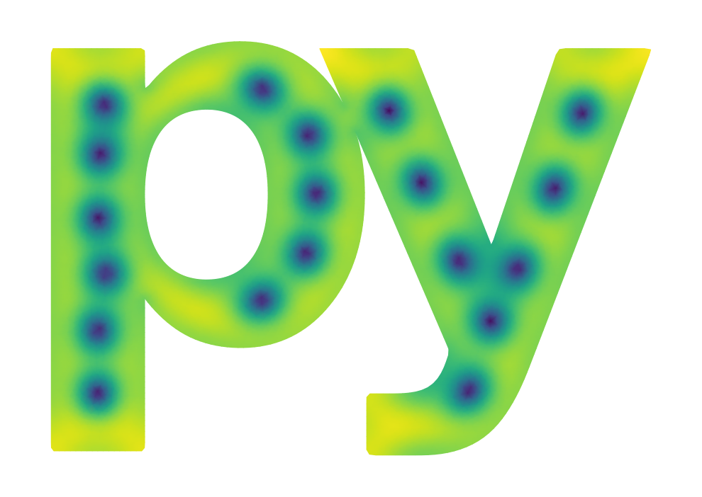

.. pyTDGL documentation master file, created by
   sphinx-quickstart on Thu Sep 29 15:33:39 2022.
   You can adapt this file completely to your liking, but it should at least
   contain the root `toctree` directive.

pyTDGL: Time-dependent Ginzburg Landau in Python
===================================================

`pyTDGL <https://github.com/loganbvh/py-tdgl>`_ is a Python package that solves a generalized time-dependent Ginzburg-Landau (TDGL)
model in two dimensions, enabling simulations of vortex and phase dynamics in thin film superconducting devices of arbitrary
geometry. The package provides a convenient interface for defining complex `device geometries <api/device.rst>`_ and generating
the corresponding `finite-element <api/finite-volume.rst>`_ data structures. ``pyTDGL`` also includes many methods for
:ref:`post-processing <api/solution:post-processing>` and :ref:`visualizing <api/visualization:Visualization>`
spatially- and temporally-resolved simulation results.

To get started using ``pyTDGL`` see `Installation <installation.rst>`_ and `Quickstart <notebooks/quickstart.ipynb>`_.
To learn more about the physics and numerics, see `Theoretical Background <background.rst>`_.

Acknowledgements
----------------

Parts of this package have been adapted from `SuperDetectorPy <https://github.com/afsa/super-detector-py>`_,
a GitHub repo authored by `Mattias Jönsson <https://github.com/afsa>`_. Both ``SuperDetectorPy`` and ``pyTDGL``
are released under the open-source MIT License. If you use either package in an academic publication or similar,
please consider citing the following:

- Mattias Jönsson, Theory for superconducting few-photon detectors (Doctoral dissertation),
  KTH Royal Institute of Technology (2022) (`Link <http://urn.kb.se/resolve?urn=urn:nbn:se:kth:diva-312132>`_).
- Mattias Jönsson, Robert Vedin, Samuel Gyger, James A. Sutton, Stephan Steinhauer, Val Zwiller, Mats Wallin, Jack Lidmar,
  Current crowding in nanoscale superconductors within the Ginzburg-Landau model, Phys. Rev. Applied 17, 064046 (2022)
  (`Link <https://journals.aps.org/prapplied/abstract/10.1103/PhysRevApplied.17.064046>`_).

The ``pyTDGL`` Python API is adapted from `SuperScreen <https://superscreen.readthedocs.io/en/latest/>`_
(`GitHub repo <hub.com/loganbvh/superscreen>`_, `journal article <https://doi.org/10.1016/j.cpc.2022.108464>`_,
`arXiv preprint <https://arxiv.org/abs/2203.13388>`_).

.. toctree::
   :maxdepth: 2
   :caption: Getting Started

   installation.rst
   notebooks/quickstart.ipynb
   background.rst

.. toctree::
   :maxdepth: 2
   :caption: Tutorials

   notebooks/polygons.ipynb
   notebooks/logo.ipynb

.. toctree::
   :maxdepth: 2
   :caption: API Reference

   api/device.rst
   api/solver.rst
   api/solution.rst
   api/finite-volume.rst
   api/visualization.rst

.. toctree::
   :maxdepth: 2
   :caption: About pyTDGL

   about/license.rst
   about/contributing.rst
   .. about/changelog.rst
   .. about/references.rst

.. Indices and tables
.. ==================

.. * :ref:`genindex`
.. * :ref:`modindex`
.. * :ref:`search`
